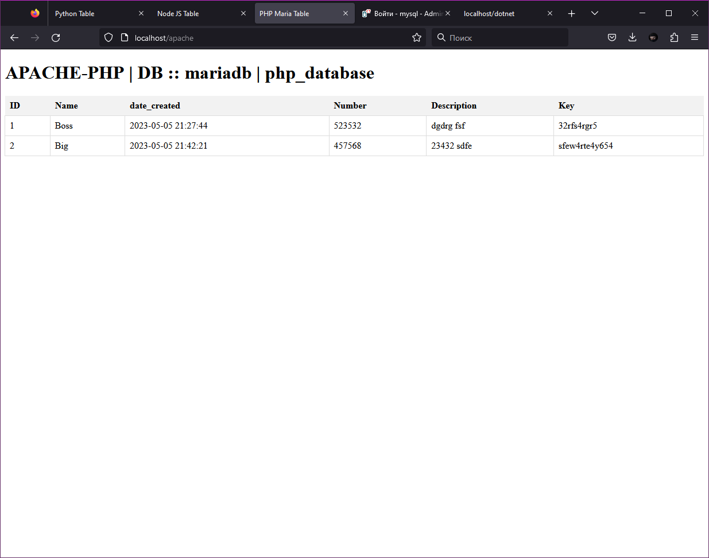
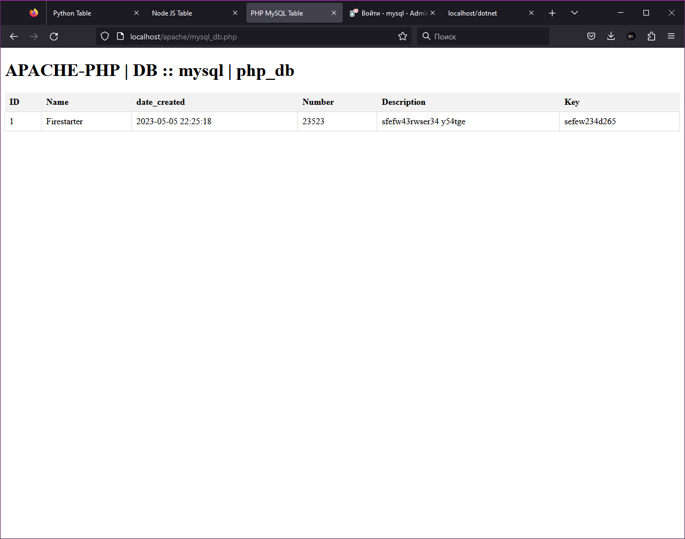
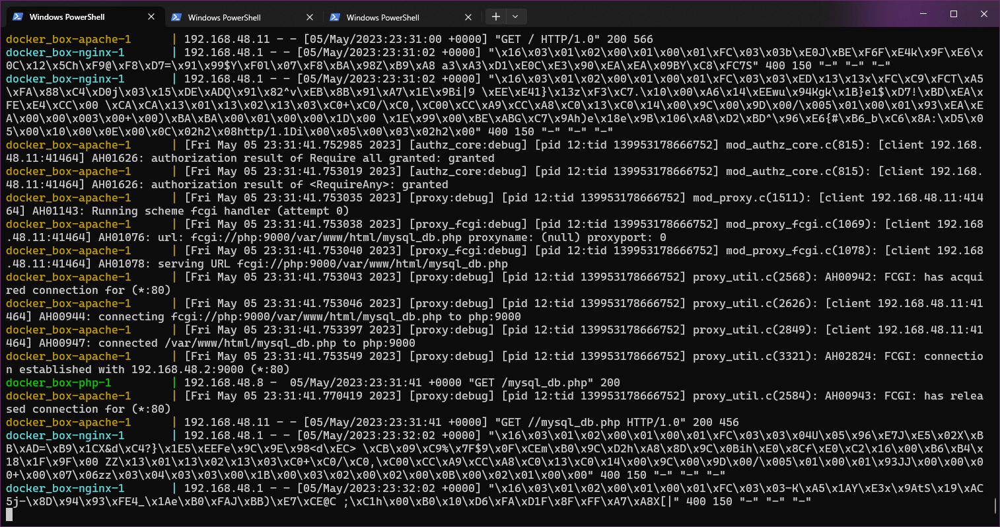
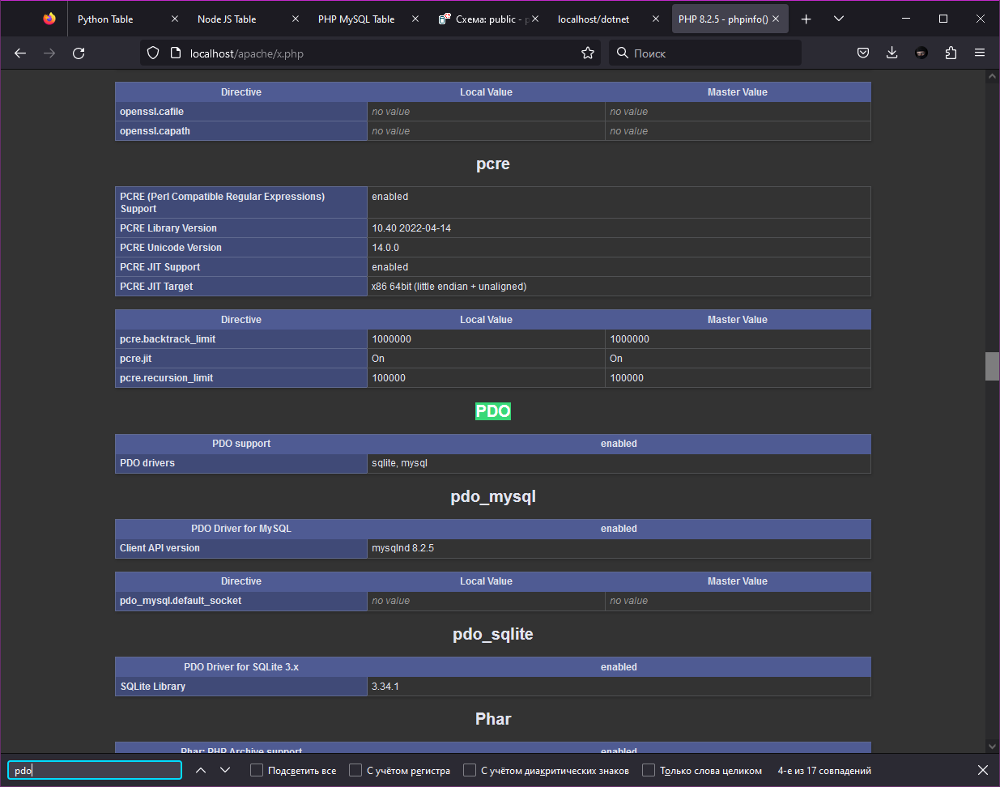
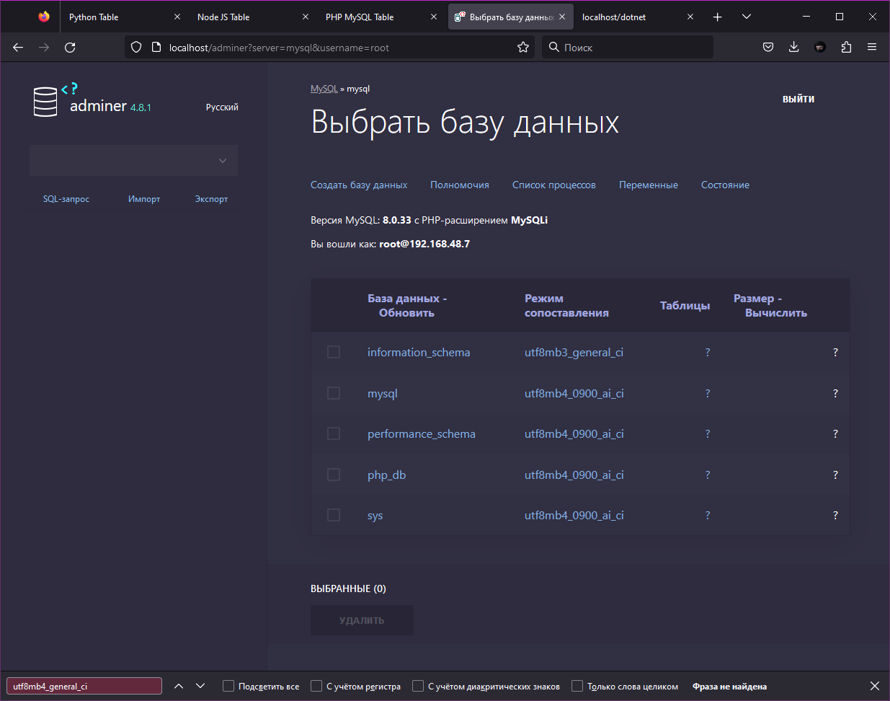
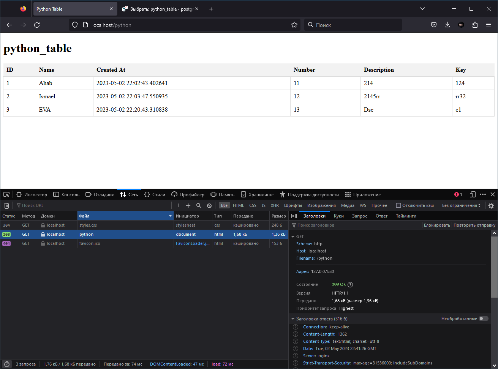
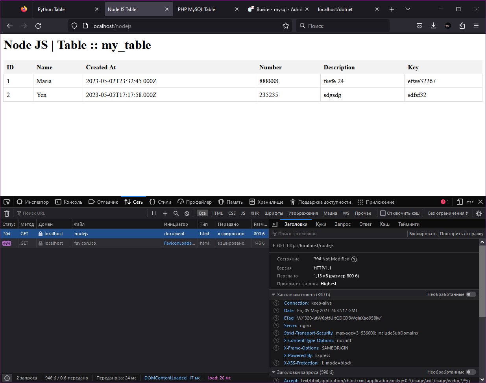
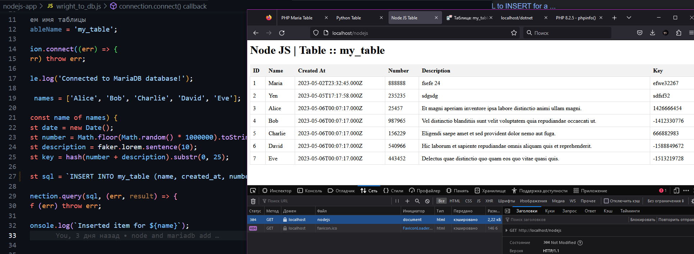
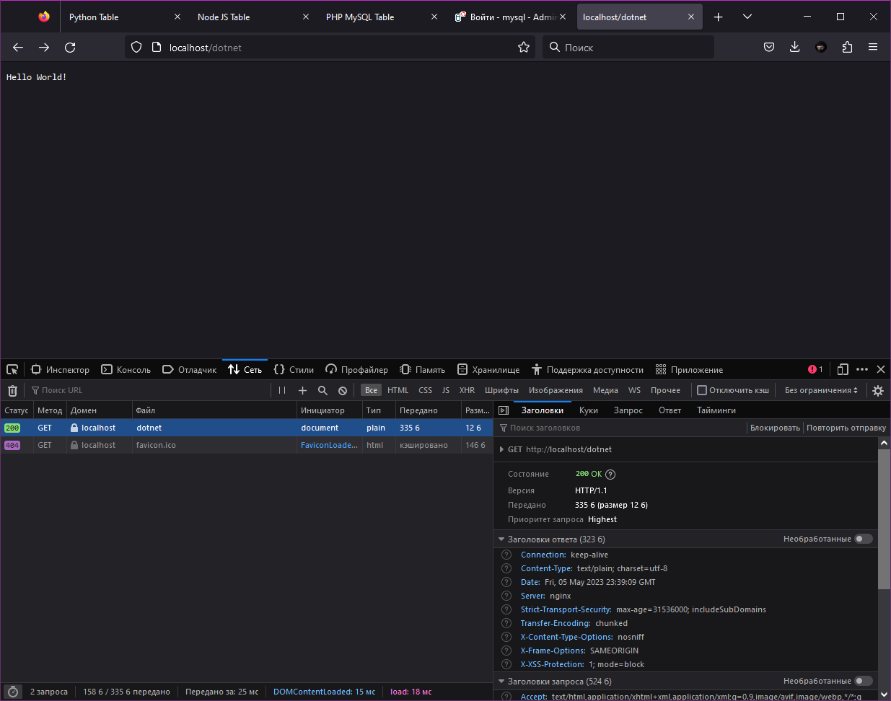

# DOCKER BOX


**nginx, apache, php, .net, python, nodejs, adminer, certbot, mysql, mariadb, postgres, certbot**


Available now:
```
- Nginx
- Apache
- PHP
- Adminer
- Postgres
- Python
- Node JS 
- Maria DB 
- MySQL
- .NET
```

## PS 

```
$ docker compose ps
NAME                      IMAGE                   COMMAND                  SERVICE             CREATED             STATUS              PORTS
docker_box-adminer-1      adminer                 "entrypoint.sh php -…"   adminer             10 minutes ago      Up 4 minutes        8080/tcp
docker_box-apache-1       httpd:latest            "httpd-foreground"       apache              10 minutes ago      Up 4 minutes        80/tcp
docker_box-dotnet-1       docker_box-dotnet       "dotnet watch --proj…"   dotnet              4 minutes ago       Up 4 minutes        8020/tcp
docker_box-mariadb-1      mariadb:latest          "docker-entrypoint.s…"   mariadb             10 minutes ago      Up 4 minutes        3306/tcp
docker_box-mysql-1        mysql:8.0               "docker-entrypoint.s…"   mysql               10 minutes ago      Up 4 minutes        3306/tcp, 33060/tcp
docker_box-nginx-1        nginx                   "/docker-entrypoint.…"   nginx               10 minutes ago      Up 4 minutes        0.0.0.0:80->80/tcp
docker_box-nodejs-app-1   node:19                 "docker-entrypoint.s…"   nodejs-app          10 minutes ago      Up 4 minutes
docker_box-php-1          docker_box-php          "docker-php-entrypoi…"   php                 10 minutes ago      Up 4 minutes        9000/tcp
docker_box-postgres-1     postgres:latest         "docker-entrypoint.s…"   postgres            10 minutes ago      Up 4 minutes        5432/tcp
docker_box-python-app-1   docker_box-python-app   "python ./app_html.py"   python-app          10 minutes ago      Up 4 minutes
```
## NGINX

Nginx

http://localhost/

## APACHE

Apache httpd

http://localhost/apache 




http://localhost/apache/mysql_db.php



```
  apache:
    image: httpd:latest
    volumes:
      - ./apache/html:/var/www/html
      - ./apache/conf/httpd.conf:/usr/local/apache2/conf/httpd.conf
    networks:
      - app-network
    depends_on:
        - php
```



## PHP 

PHP8.2 + PDO


docker compose
```
  php:
    build:
      context: .
      dockerfile: Dockerfile.php
    volumes:
      - ./apache/html:/var/www/html
    networks:
      - app-network    
```
Dockerfile.php
```
FROM php:8.2-fpm

RUN docker-php-ext-install pdo_mysql
```
## ADMINER

http://localhost/adminer



Оформление:
```
    environment:
      ADMINER_DESIGN: pepa-linha-dark
```

Maria DB 
```
node_db
php_database
my_database
```
MySQL
```
php_db
```
Posgres
```
postgres
```

## PYTHON 

http://localhost/python



`app_html.py` - рендерит страницу, выводит записи из БД

`app_delete_frome_tb.py` - удаляет все записи в БД (id остаётся!)

`app_wright_table.py` - записывает в таблицу БД, сам создаёт данные для каждого имени из `names`

## NODE JS 

http://localhost/nodejs



```
command: >
      sh -c "cd /app && node index.js"
    #  sh -c "cd /app && node index.js"
    #  sh -c "cd /app && npm install -g npm@9.6.6 && npm install mysql express faker && node index.js"
```

`index.js` - рендерит страницу, выводит записи из БД

```
root@10b94c039ecc:/app# npm list
app@ /app
+-- express@4.18.2
+-- faker@5.5.3
`-- mysql@2.18.1
```



```
'${date.toISOString().slice(0, 19).replace('T', ' ')}'
```


## .NET

http://localhost/dotnet



https://github.com/dotnet/dotnet-docker/blob/8f70e8dc26d3d173154a183b1503fb13a0b019ca/src/sdk/7.0/alpine3.17/amd64/Dockerfile

```
dotnet --info

dotnet new web newweb

dotnet watch --project newweb run --urls "http://0.0.0.0:8020"  
```
## DB 

`id, name, created_at, number, description, key`
## MARIA DB 

```
CREATE TABLE IF NOT EXISTS my_table (
  id INT AUTO_INCREMENT PRIMARY KEY,
  name VARCHAR(50) NOT NULL,
  created_at TIMESTAMP DEFAULT CURRENT_TIMESTAMP,
  number INT NOT NULL,
  description VARCHAR(100) NOT NULL,
  `key` VARCHAR(25) NOT NULL
);
```

```
CREATE DATABASE node_db;

USE node_db;

CREATE TABLE node_names (
  id INT AUTO_INCREMENT PRIMARY KEY,
  name VARCHAR(255) NOT NULL,
  date_created DATETIME NOT NULL,
  number INT NOT NULL,
  description TEXT,
  `key` VARCHAR(255) NOT NULL
);

CREATE USER 'node_user'@'localhost' IDENTIFIED BY 'node_pass';

GRANT ALL PRIVILEGES ON node_db.* TO 'node_user'@'localhost';
FLUSH PRIVILEGES;
```

### MySQL

```
-- Создание базы данных php_db
CREATE DATABASE php_db;

-- Создание пользователя php_ms_user с паролем php_ms_pass и предоставление прав на БД php_db
CREATE USER 'php_ms_user'@'%' IDENTIFIED BY 'php_ms_pass';
GRANT ALL PRIVILEGES ON php_db.* TO 'php_ms_user'@'%';

-- Создание таблицы php_names с необходимыми полями
USE php_db;

CREATE TABLE php_names (
  id INT(11) NOT NULL AUTO_INCREMENT,
  name VARCHAR(255) NOT NULL,
  created_at DATETIME NOT NULL,
  number INT(11) NOT NULL,
  description VARCHAR(255),
  `key` VARCHAR(255) NOT NULL,
  PRIMARY KEY (id)
) ENGINE=InnoDB DEFAULT CHARSET=utf8mb4;
```

## POSTGRES SQL

PosgresSQL
```
CREATE TABLE mytable (
  id SERIAL PRIMARY KEY,
  name VARCHAR(255) NOT NULL,
  created_at TIMESTAMP NOT NULL,
  number VARCHAR(6) NOT NULL,
  description VARCHAR(10) NOT NULL,
  key VARCHAR(25) NOT NULL
);
```